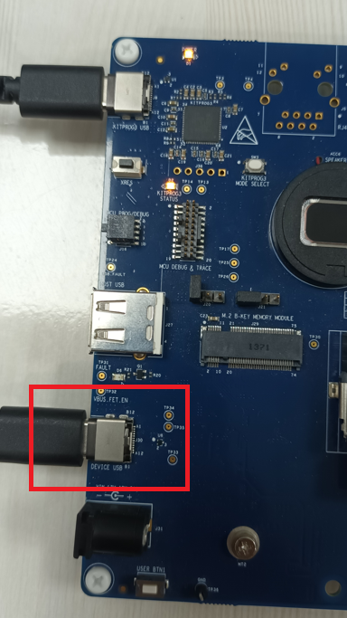
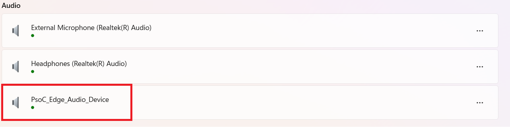
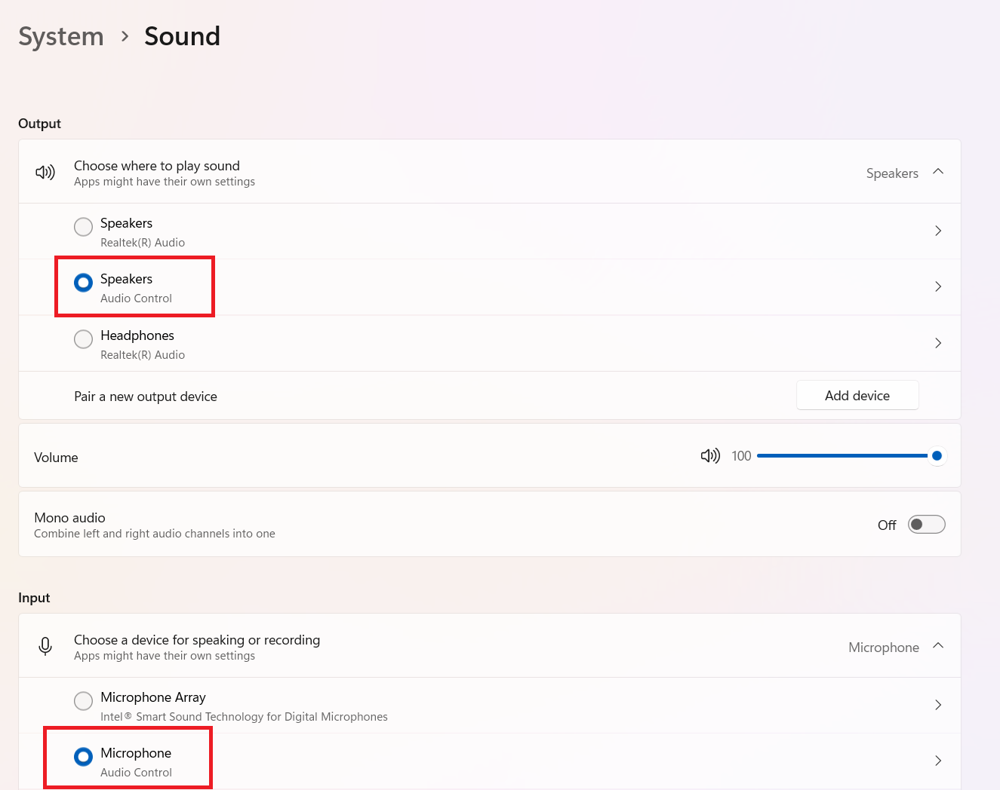
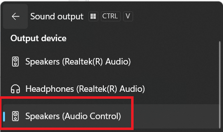
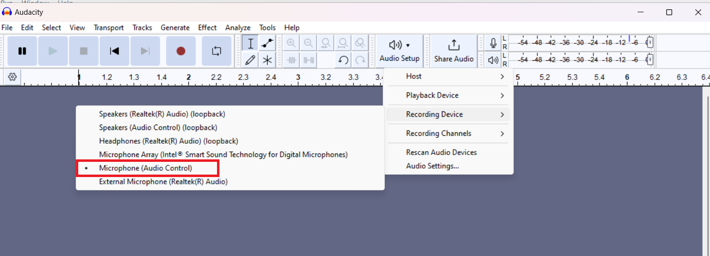
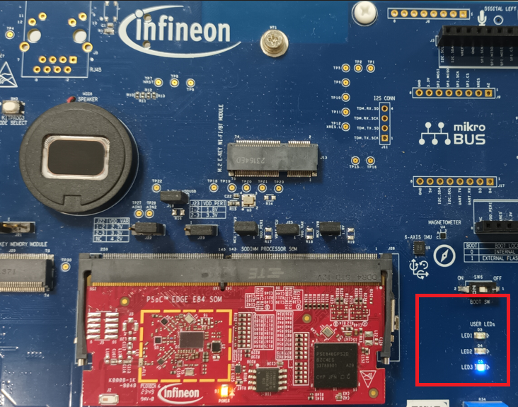
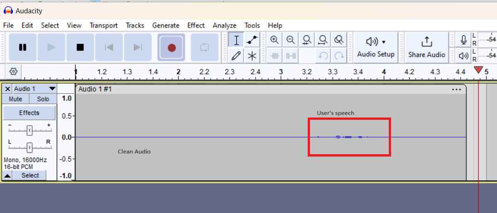
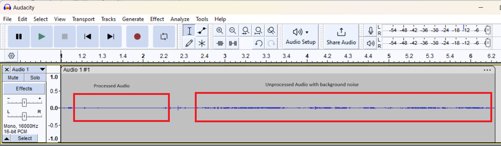

# PSOC&trade; Edge MCU: DEEPCRAFT&trade; Audio Enhancement Application

This code example demonstrates how to process audio data using Infineon's DEEPCRAFT&trade; Audio Enhancement (AE) solution, which includes a suite of audio processing algorithms useful for voice and audio applications on Infineon's PSOC&trade; Edge MCU. It executes from Arm&reg; Cortex&reg; M55 core.

DEEPCRAFT&trade; Audio Enhancement includes the Audio Enhancement application, Audio front end (AFE) middleware that interfaces to audio-voice-core algorithms via AFE components and AFE Configurator for tuning. 

In this example, speech is captured using pulse density modulation (PDM) digital microphones on the PSOC&trade; Edge MCU kit. Audio data is streamed over USB Audio Class (UAC) from the PC to the kit and played back on the onboard speaker via I2S. This streamed data is also used as the acoustic echo cancellation (AEC) reference by the AFE middleware. When there is no data streamed to the kit via USB, AFE middleware executes other AFE components – that are enabled or disabled via the AFE Configurator apart from AEC.

The PDM data and AEC reference data (if present) is sent to the AFE middleware which uses AFE components – such as Beam Forming, Noise Suppression, AEC/Echo Suppression, Dereveberation, and High Pass filters – and processes the PDM data. The processed data is then sent back to the PC via UAC. 

This code example has a three project structure: CM33 secure, CM33 non-secure, and CM55 projects. All three projects are programmed to the external QSPI flash and executed in Execute in Place (XIP) mode. Critical codes are executed from SoCMEM and Tightly Coupled Memories (TCM). Extended boot launches the CM33 secure project from a fixed location in the external flash, which then configures the protection settings and launches the CM33 non-secure application. Additionally, CM33 non-secure application enables CM55 CPU and launches the CM55 application.

This code example uses the Peripheral Driver Library (PDL) to interface with peripherals such as PDM-PCM, I2S, and GPIO. The TLV310DAC3000 codec is used for playing audio data sent via I2S to the onboard loudspeaker. USB Audio class is used for sending data to PSOC&trade; Edge MCU and receiving data from it.

> **Note:**
> 1. See [Design guide](docs/ae_design_guide.md) for detailed description of this code example, its design, various options, and steps to use AFE Configurator and KPI details
> 2. The audio-voice-core library included in this example has a limited operation of about 15 minutes. For the unlimited license, contact Infineon support. Refer to [Using the code example](docs/using_the_code_example.md) or refer the notes.md in proj_cm55\source\modules\audio_voice_core_lib for placing the licensed version of library within the code folder structure
> 3. On 15 minute timeout, the code will stop. See the Terminal output for more information, reset the board
> 4. This code example supports only the Arm&reg; and LLVM compilers which need to be installed separately. See "Software Setup" section below.
> 5. The example has two modes of operation: functional and tuning modes

## Requirements

- [ModusToolbox&trade;](https://www.infineon.com/modustoolbox) v3.6 or later (tested with v3.6)
- Board support package (BSP) minimum required version: 1.0.0
- Programming language: C
- Associated parts: All [PSOC&trade; Edge MCU](https://www.infineon.com/products/microcontroller/32-bit-psoc-arm-cortex/32-bit-psoc-edge-arm) parts

## Supported toolchains (make variable 'TOOLCHAIN')

- Arm&reg; Compiler v6.22 (`ARM`)
- LLVM Embedded Toolchain for Arm&reg; v19.1.5 (`LLVM_ARM`) – Default value of `TOOLCHAIN`

## Supported kits (make variable 'TARGET')

- [PSOC&trade; Edge E84 Evaluation Kit](https://www.infineon.com/KIT_PSE84_EVAL) (`KIT_PSE84_EVAL_EPC2`) – Default value of `TARGET`
- [PSOC&trade; Edge E84 Evaluation Kit](https://www.infineon.com/KIT_PSE84_EVAL) (`KIT_PSE84_EVAL_EPC4`)

## Hardware setup

This example uses the board's default configuration. See the kit user guide to ensure that the board is configured correctly.

Ensure the following jumper and pin configuration on board.
- BOOT SW must be in the HIGH/ON position
- J20 and J21 must be in the tristate/not connected (NC) position

## Software setup

See the [ModusToolbox&trade; tools package installation guide](https://www.infineon.com/ModusToolboxInstallguide) for information about installing and configuring the tools package.

Install a terminal emulator if you do not have one. Instructions in this document use [Tera Term](https://teratermproject.github.io/index-en.html).

Install Arm&reg; Compiler for Embedded version 6.22.  Note that an Arm&reg; account and license is required for the Arm&reg; compiler.  [Arm-Compiler](https://developer.arm.com/downloads/view/ACOMPE)

Alternatively, install LLVM compiler which does not require a license. [LLVM](https://github.com/ARM-software/LLVM-embedded-toolchain-for-Arm/releases/tag/release-19.1.5)

Install the DEEPCRAFT&trade; Audio Enhancement Tech Pack to access the AFE Configurator tool.

This example requires the Audacity tool and DEEPCRAFT&trade; Studio.

Depending on your choice of compiler (Arm, LLVM), set these env variables or uncomment in common.mk and set the path.  

1.	Arm Compiler for Embedded  
	CY_COMPILER_ARM_DIR=[path to Arm compiler installation]  
For example: C:/Program Files/ArmCompilerforEmbedded6.22  

2. 	LLVM compiler  
	CY_COMPILER_LLVM_ARM_DIR=[path to LLVM compiler location]  
For example: C:/llvm/LLVM-ET-Arm-19.1.5-Windows-x86_64  

## Operation in default mode 

1. The default mode of this code example is *functional* mode. Ensure to set CONFIG_AE_MODE=FUNCTIONAL in common.mk.
See the [Using the code example](docs/using_the_code_example.md) and build/flash the firmware to the kit. After flashing, connect an additional USB cable to the 'Device USB' port of the kit

   **Figure 1. USB device connection**
   
   

2. Observe the PSOC&trade; Edge MCU enumerate as a **Stereo USB Speaker** and **Mono channel USB Mic** on the PC

   **Figure 2. Device enumeration as a USB speaker**
   
   
   
   **Figure 3. Device enumeration as a USB microphone**

   

3. Choose **Speakers (Audio Control)** as the audio output device of the PC 

   **Figure 4. Selecting sound output**
   
   

4. Play any music or speech audio from local files or the Internet. The code also includes a default test stream located at *ae_test_stream/ae_test_stream.wav* which can be played via the Media Player or Audacity tool.  
The streamed audio will be output via the PSOC&trade; Edge MCU on-board speaker.  
You can also choose not to play anything on the device speaker to evaluate other algorithms such as Noise Suppression or Beam Forming

5. Launch Audacity and choose the microphone
   
   **Figure 5. Selecting microphone in Audacity**

    

6. Click the record icon. The PC starts recording using the PSOC&trade; Edge MCU kit. Speak to the kit's PDM microphone

7. Observe the blue LED on the kit. If it is on, it means the AE processed data is received via USB to the PC and the recorded audio will be cleaner

   **Figure 6. Observe the LED on the kit**
   
   

   **Figure 7. Observe AE processed audio**

   

8. Press USER_BTN1; if the blue LED is off, then AE unprocessed data is received via USB to the PC. The recorded audio will have background noise captured by the PDM mic along with your speech

   **Figure 8. Observe processed and unprocessed data controlled via USER_BTN1**

   

## Design guide

See the [Design guide](docs/ae_design_guide.md) for detailed description of this code example, design, various options (such as tuning and functional modes), and how to tune using AFE Configurator and KPI details.

## Related resources

Resources  | Links
-----------|----------------------------------
Application notes  | [AN235935](https://www.infineon.com/AN235935) – Getting started with PSOC&trade; Edge E8 MCU on ModusToolbox&trade; software   [AN240916](https://www.infineon.com/AN240916) - DEEPCRAFT&trade; Audio Enhancement on PSOC&trade; Edge E84 MCU
Code examples  | [Using ModusToolbox&trade;](https://github.com/Infineon/Code-Examples-for-ModusToolbox-Software) on GitHub
Device documentation | [PSOC&trade; Edge MCU datasheets](https://www.infineon.com/products/microcontroller/32-bit-psoc-arm-cortex/32-bit-psoc-edge-arm#documents)   [PSOC&trade; Edge MCU reference manuals](https://www.infineon.com/products/microcontroller/32-bit-psoc-arm-cortex/32-bit-psoc-edge-arm#documents)
Development kits | Select your kits from the [Evaluation board finder](https://www.infineon.com/cms/en/design-support/finder-selection-tools/product-finder/evaluation-board)
Libraries  | [mtb-dsl-pse8xxgp](https://github.com/Infineon/mtb-dsl-pse8xxgp) – Device support library for PSE8XXGP   [retarget-io](https://github.com/Infineon/retarget-io) – Utility library to retarget STDIO messages to a UART port
Tools  | [ModusToolbox&trade;](https://www.infineon.com/modustoolbox) – ModusToolbox&trade; software is a collection of easy-to-use libraries and tools enabling rapid development with Infineon MCUs for applications ranging from wireless and cloud-connected systems, edge AI/ML, embedded sense and control, to wired USB connectivity using PSOC&trade; Industrial/IoT MCUs, AIROC&trade; Wi-Fi and Bluetooth&reg; connectivity devices, XMC&trade; Industrial MCUs, and EZ-USB&trade;/EZ-PD&trade; wired connectivity controllers. ModusToolbox&trade; incorporates a comprehensive set of BSPs, HAL, libraries, configuration tools, and provides support for industry-standard IDEs to fast-track your embedded application development

 

## Other resources

Infineon provides a wealth of data at [www.infineon.com](https://www.infineon.com) to help you select the right device, and quickly and effectively integrate it into your design.

## Document history

Document title: *CE241960* - *PSOC&trade; Edge MCU: DEEPCRAFT&trade; Audio Enhancement Application*

 Version | Description of change
 ------- | ---------------------
 1.x.0   | New code example   Early access release
 2.0.0   | GitHub release
 

All referenced product or service names and trademarks are the property of their respective owners.

The Bluetooth&reg; word mark and logos are registered trademarks owned by Bluetooth SIG, Inc., and any use of such marks by Infineon is under license.

PSOC&trade;, formerly known as PSoC&trade;, is a trademark of Infineon Technologies. Any references to PSoC&trade; in this document or others shall be deemed to refer to PSOC&trade;.

---------------------------------------------------------

© Cypress Semiconductor Corporation, 2023-2025. This document is the property of Cypress Semiconductor Corporation, an Infineon Technologies company, and its affiliates ("Cypress").  This document, including any software or firmware included or referenced in this document ("Software"), is owned by Cypress under the intellectual property laws and treaties of the United States and other countries worldwide.  Cypress reserves all rights under such laws and treaties and does not, except as specifically stated in this paragraph, grant any license under its patents, copyrights, trademarks, or other intellectual property rights.  If the Software is not accompanied by a license agreement and you do not otherwise have a written agreement with Cypress governing the use of the Software, then Cypress hereby grants you a personal, non-exclusive, nontransferable license (without the right to sublicense) (1) under its copyright rights in the Software (a) for Software provided in source code form, to modify and reproduce the Software solely for use with Cypress hardware products, only internally within your organization, and (b) to distribute the Software in binary code form externally to end users (either directly or indirectly through resellers and distributors), solely for use on Cypress hardware product units, and (2) under those claims of Cypress's patents that are infringed by the Software (as provided by Cypress, unmodified) to make, use, distribute, and import the Software solely for use with Cypress hardware products.  Any other use, reproduction, modification, translation, or compilation of the Software is prohibited.
 
TO THE EXTENT PERMITTED BY APPLICABLE LAW, CYPRESS MAKES NO WARRANTY OF ANY KIND, EXPRESS OR IMPLIED, WITH REGARD TO THIS DOCUMENT OR ANY SOFTWARE OR ACCOMPANYING HARDWARE, INCLUDING, BUT NOT LIMITED TO, THE IMPLIED WARRANTIES OF MERCHANTABILITY AND FITNESS FOR A PARTICULAR PURPOSE.  No computing device can be absolutely secure.  Therefore, despite security measures implemented in Cypress hardware or software products, Cypress shall have no liability arising out of any security breach, such as unauthorized access to or use of a Cypress product. CYPRESS DOES NOT REPRESENT, WARRANT, OR GUARANTEE THAT CYPRESS PRODUCTS, OR SYSTEMS CREATED USING CYPRESS PRODUCTS, WILL BE FREE FROM CORRUPTION, ATTACK, VIRUSES, INTERFERENCE, HACKING, DATA LOSS OR THEFT, OR OTHER SECURITY INTRUSION (collectively, "Security Breach").  Cypress disclaims any liability relating to any Security Breach, and you shall and hereby do release Cypress from any claim, damage, or other liability arising from any Security Breach.  In addition, the products described in these materials may contain design defects or errors known as errata which may cause the product to deviate from published specifications. To the extent permitted by applicable law, Cypress reserves the right to make changes to this document without further notice. Cypress does not assume any liability arising out of the application or use of any product or circuit described in this document. Any information provided in this document, including any sample design information or programming code, is provided only for reference purposes.  It is the responsibility of the user of this document to properly design, program, and test the functionality and safety of any application made of this information and any resulting product.  "High-Risk Device" means any device or system whose failure could cause personal injury, death, or property damage.  Examples of High-Risk Devices are weapons, nuclear installations, surgical implants, and other medical devices.  "Critical Component" means any component of a High-Risk Device whose failure to perform can be reasonably expected to cause, directly or indirectly, the failure of the High-Risk Device, or to affect its safety or effectiveness.  Cypress is not liable, in whole or in part, and you shall and hereby do release Cypress from any claim, damage, or other liability arising from any use of a Cypress product as a Critical Component in a High-Risk Device. You shall indemnify and hold Cypress, including its affiliates, and its directors, officers, employees, agents, distributors, and assigns harmless from and against all claims, costs, damages, and expenses, arising out of any claim, including claims for product liability, personal injury or death, or property damage arising from any use of a Cypress product as a Critical Component in a High-Risk Device. Cypress products are not intended or authorized for use as a Critical Component in any High-Risk Device except to the limited extent that (i) Cypress's published data sheet for the product explicitly states Cypress has qualified the product for use in a specific High-Risk Device, or (ii) Cypress has given you advance written authorization to use the product as a Critical Component in the specific High-Risk Device and you have signed a separate indemnification agreement.
 
Cypress, the Cypress logo, and combinations thereof, ModusToolbox, PSoC, CAPSENSE, EZ-USB, F-RAM, and TRAVEO are trademarks or registered trademarks of Cypress or a subsidiary of Cypress in the United States or in other countries. For a more complete list of Cypress trademarks, visit www.infineon.com. Other names and brands may be claimed as property of their respective owners.