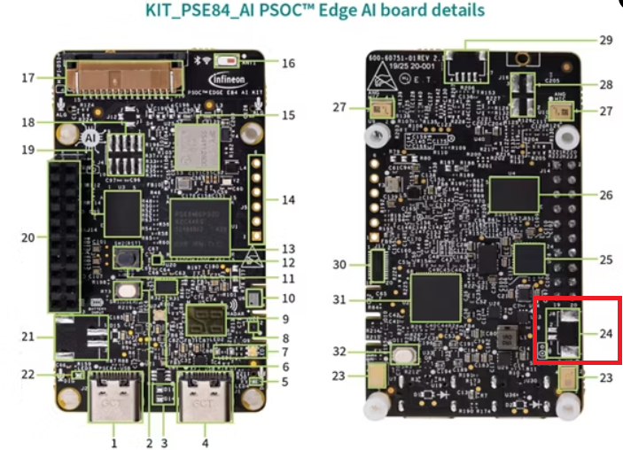
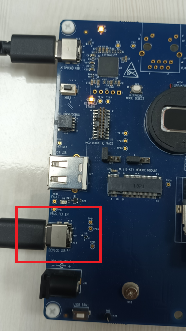
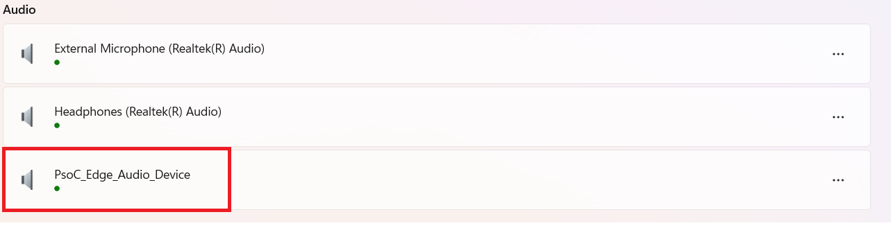
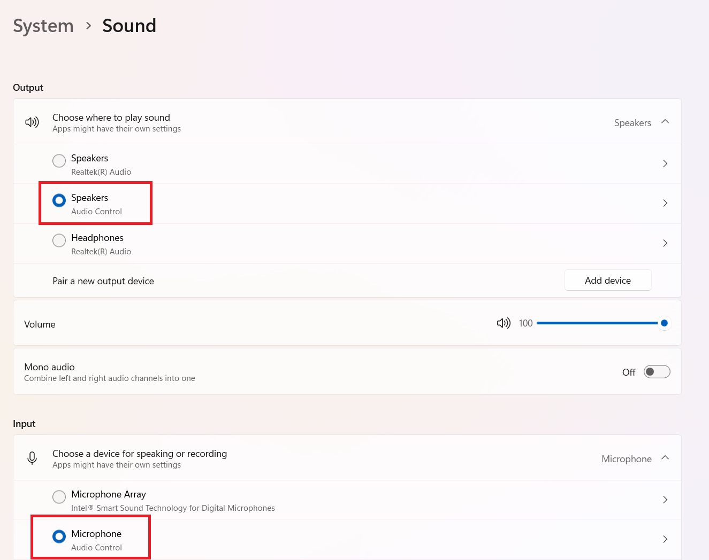
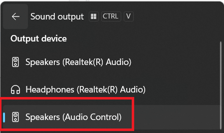
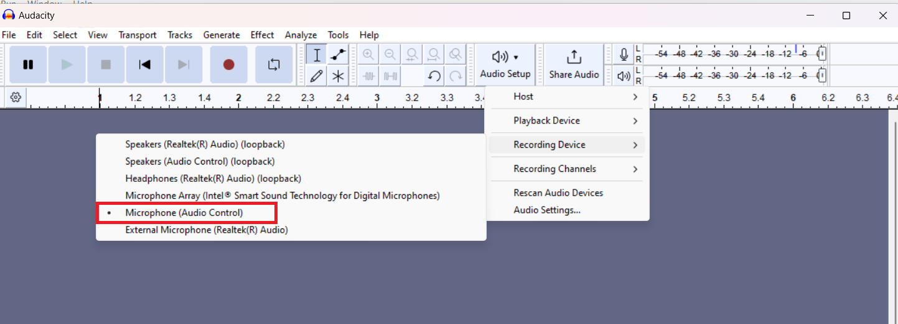
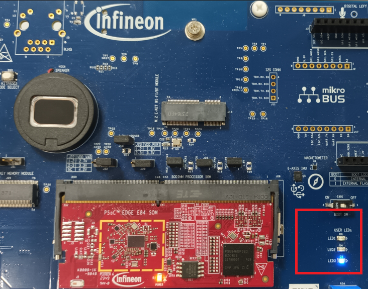
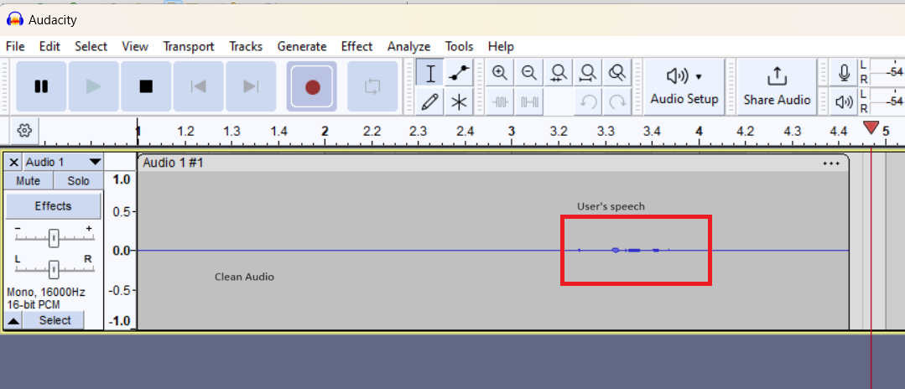
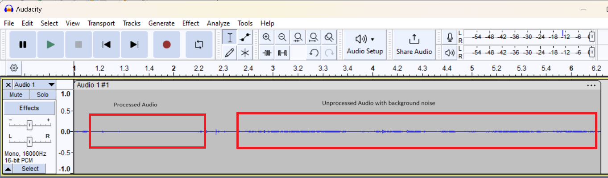
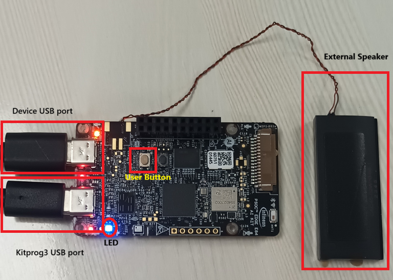

# PSOC&trade; Edge MCU: DEEPCRAFT&trade; Audio Enhancement Application

This code example demonstrates how to process audio data using Infineon's DEEPCRAFT&trade; Audio Enhancement (AE) solution, which includes a suite of audio processing algorithms useful for voice and audio applications on Infineon's PSOC&trade; Edge MCU. It executes from Arm&reg; Cortex&reg; M55 core.

DEEPCRAFT&trade; Audio Enhancement includes the Audio Enhancement application, Audio front end (AFE) middleware that interfaces to audio-voice-core algorithms via AFE components and AFE Configurator for tuning.

In this example, speech is captured using pulse density modulation (PDM) digital microphones on the PSOC&trade; Edge MCU kit. Audio data is streamed over USB Audio Class (UAC) from the PC to the kit and played back on the onboard speaker via I2S. This streamed data is also used as the acoustic echo cancellation (AEC) reference by the AFE middleware. When there is no data streamed to the kit via USB, AFE middleware executes other AFE components – that are enabled or disabled via the AFE Configurator apart from AEC.

The PDM data and AEC reference data (if present) is sent to the AFE middleware which uses AFE components – such as Beam Forming, Noise Suppression, AEC/Echo Suppression, Dereverberation, and High Pass filters – and processes the PDM data. The processed data is then sent back to the PC via UAC.

This code example has a three project structure: CM33 secure, CM33 non-secure, and CM55 projects. All three projects are programmed to the external QSPI flash and executed in Execute in Place (XIP) mode. Critical codes are executed from SoCMEM and Tightly Coupled Memories (TCM). Extended boot launches the CM33 secure project from a fixed location in the external flash, which then configures the protection settings and launches the CM33 non-secure application. Additionally, CM33 non-secure application enables CM55 CPU and launches the CM55 application.
> **Note:** On the KIT_PSE84_HMI, all three projects are programmed to the external OSPI flash instead of QSPI.

This code example uses the Peripheral Driver Library (PDL) to interface with peripherals such as PDM-PCM, I2S, and GPIO. The TLV320DAC3100 codec is used for playing audio data sent via I2S to the onboard loudspeaker. USB Audio class is used for sending data to PSOC&trade; Edge MCU and receiving data from it.

> **Note:**
> 1. See [Design guide](docs/ae_design_guide.md) for detailed description of this code example, its design, various options, and steps to use AFE Configurator and KPI details
> 2. The audio-voice-core library included in this example has a limited operation of about 15 minutes. For the unlimited license, contact Infineon support. Refer to [Using the code example](docs/using_the_code_example.md) or refer the notes.md in proj_cm55\source\modules\audio_voice_core_lib for placing the licensed version of library within the code folder structure
> 3. On 15 minute timeout, audio processing will stop and timeout message will appear on the UART Terminal. Refer the Terminal output for more information and reset the board
> 4. This code example supports only the Arm&reg; and LLVM compilers which need to be installed separately. See "Software Setup" section below.
> 5. The code example has two modes of operation: functional and tuning modes
> 6. The code example also supports Automatic Gain Control (AGC) on AE processed data. By default, it is disabled. Refer to the [Design guide](docs/ae_design_guide.md) for its usage

## Requirements

- [ModusToolbox&trade;](https://www.infineon.com/modustoolbox) v3.7 or later (tested with v3.8)
- Board support package (BSP) minimum required version: 1.0.0
- Programming language: C
- Associated parts: All [PSOC&trade; Edge MCU](https://www.infineon.com/products/microcontroller/32-bit-psoc-arm-cortex/32-bit-psoc-edge-arm) parts

## Supported toolchains (make variable 'TOOLCHAIN')

- Arm&reg; Compiler v6.22 (`ARM`)
- LLVM Embedded Toolchain for Arm&reg; v19.1.5 (`LLVM_ARM`) – Default value of `TOOLCHAIN`

## Supported kits (make variable 'TARGET')

- [PSOC&trade; Edge E84 Evaluation Kit](https://www.infineon.com/KIT_PSE84_EVAL) (`KIT_PSE84_EVAL_EPC2`) – Default value of `TARGET`
- [PSOC&trade; Edge E84 Evaluation Kit](https://www.infineon.com/KIT_PSE84_EVAL) (`KIT_PSE84_EVAL_EPC4`)
- [PSOC&trade; Edge E84 AI Kit](https://www.infineon.com/KIT_PSE84_AI) (`KIT_PSE84_AI`)
- [PSOC&trade; Edge E84 HMI Kit](https://www.infineon.com/KIT_PSE84_HMI) (`KIT_PSE84_HMI`)

## Hardware setup

This example uses the board's default configuration. See the kit user guide to ensure that the board is configured correctly.

Ensure the following jumper and pin configuration on board.
- BOOT SW must be in the HIGH/ON position
- J20 and J21 must be in the tristate/not connected (NC) position for the PSOC&trade; Edge E84 Evaluation Kit

> **Note:** This hardware setup is not required for PSOC&trade; Edge E84 AI Kit (KIT_PSE84_AI).

For PSOC&trade; Edge E84 AI Kit, external speakers need to be soldered to the pins 24,as shown in below picture

**Figure 1. PSOC&trade; Edge E84 AI Kit pins**

 

The part number of the recommended speaker for PSOC&trade; Edge E84 AI Kit is CAC45-02W70-06-1 .

## Software setup

See the [ModusToolbox&trade; tools package installation guide](https://www.infineon.com/ModusToolboxInstallguide) for information about installing and configuring the tools package.

Install a terminal emulator if you do not have one. Instructions in this document use [Tera Term](https://teratermproject.github.io/index-en.html).

Install Arm&reg; Compiler for Embedded version 6.22.  Note that an Arm&reg; account and license is required for the Arm&reg; compiler.  [Arm-Compiler](https://developer.arm.com/downloads/view/ACOMPE)

Alternatively, install LLVM compiler which does not require a license. [LLVM](https://github.com/ARM-software/LLVM-embedded-toolchain-for-Arm/releases/tag/release-19.1.5)

Install the DEEPCRAFT&trade; Audio Enhancement Tech Pack to access the AFE Configurator tool.

This example requires the Audacity tool and DEEPCRAFT&trade; Studio.

Depending on your choice of compiler (Arm, LLVM), set these env variables or uncomment in common.mk and set the path.  

1.	Arm Compiler for Embedded  
	CY_COMPILER_ARM_DIR=[path to Arm compiler installation]  
For example: C:/Program Files/ArmCompilerforEmbedded6.22  

2. 	LLVM compiler  
	CY_COMPILER_LLVM_ARM_DIR=[path to LLVM compiler location]  
For example: C:/llvm/LLVM-ET-Arm-19.1.5-Windows-x86_64  

## Operation in default mode - PSOC&trade; Edge E84 Evaluation Kit

1. The default mode of this code example is *functional* mode. Ensure to set CONFIG_AE_MODE=FUNCTIONAL in common.mk.
Refer [Using the code example](docs/using_the_code_example.md) and build/flash the firmware to the kit. After flashing, connect an additional USB cable to the 'Device USB' port of the kit

   **Figure 2. USB device connection**

   

2. Observe the PSOC&trade; Edge MCU enumerate as a **Stereo USB Speaker** and **Mono channel USB Mic** on the PC

   **Figure 3. Device enumeration as a USB speaker**

   

   **Figure 4. Device enumeration as a USB microphone**

   

3. Choose **Speakers (Audio Control)** as the audio output device of the PC

   **Figure 5. Selecting sound output**

   

4. Play any music or speech audio from local files or the Internet. The code also includes a default test stream located at *ae_test_stream/ae_test_stream.wav* which can be played via the Media Player or Audacity tool.  
The streamed audio will be output via the PSOC&trade; Edge MCU on-board speaker.  
You can also choose not to play anything on the device speaker to evaluate other algorithms such as Noise Suppression or Beam Forming

5. Launch Audacity and choose the microphone

   **Figure 6. Selecting microphone in Audacity**

    

6. Click the record icon. The PC starts recording using the PSOC&trade; Edge MCU kit. Speak to the kit's PDM microphone

7. Observe the blue LED on the kit. If it is on, it means the AE processed data is received via USB to the PC and the recorded audio will be cleaner

   **Figure 7. Observe the LED on the kit**

   

   **Figure 8. Observe AE processed audio**

   

8. Press USER_BTN1; if the blue LED is off, then AE unprocessed data is received via USB to the PC. The recorded audio will have background noise captured by the PDM mic along with your speech

   **Figure 9. Observe processed and unprocessed data controlled via USER_BTN1**

   

## Operation in default mode - PSOC&trade; Edge E84 AI Kit:

For PSOC&trade; Edge E84 AI Kit, The operational steps are same as EVK. PSOC&trade; Edge E84 AI kit has only one user button as highlighted in below picture. The following picture shows the ports/LED of the kit. External speakers also have to be connected.

   **Figure 10. PSOC&trade; Edge E84 AI Kit setup**

   

## Design guide

See the [Design guide](docs/ae_design_guide.md) for detailed description of this code example, design, various options (such as tuning and functional modes), and how to tune using AFE Configurator and KPI details.

## Related resources

Resources  | Links
-----------|----------------------------------
Application notes  | [AN235935](https://www.infineon.com/AN235935) – Getting started with PSOC&trade; Edge E8 MCU on ModusToolbox&trade; software   [AN240916](https://www.infineon.com/AN240916) - DEEPCRAFT&trade; Audio Enhancement on PSOC&trade; Edge E84 MCU
Code examples  | [Using ModusToolbox&trade;](https://github.com/Infineon/Code-Examples-for-ModusToolbox-Software) on GitHub
Device documentation | [PSOC&trade; Edge MCU datasheets](https://www.infineon.com/products/microcontroller/32-bit-psoc-arm-cortex/32-bit-psoc-edge-arm#documents)   [PSOC&trade; Edge MCU reference manuals](https://www.infineon.com/products/microcontroller/32-bit-psoc-arm-cortex/32-bit-psoc-edge-arm#documents)
Development kits | Select your kits from the [Evaluation board finder](https://www.infineon.com/cms/en/design-support/finder-selection-tools/product-finder/evaluation-board)
Libraries  | [mtb-dsl-pse8xxgp](https://github.com/Infineon/mtb-dsl-pse8xxgp) – Device support library for PSE8XXGP   [retarget-io](https://github.com/Infineon/retarget-io) – Utility library to retarget STDIO messages to a UART port
Tools  | [ModusToolbox&trade;](https://www.infineon.com/modustoolbox) – ModusToolbox&trade; software is a collection of easy-to-use libraries and tools enabling rapid development with Infineon MCUs for applications ranging from wireless and cloud-connected systems, edge AI/ML, embedded sense and control, to wired USB connectivity using PSOC&trade; Industrial/IoT MCUs, AIROC&trade; Wi-Fi and Bluetooth&reg; connectivity devices, XMC&trade; Industrial MCUs, and EZ-USB&trade;/EZ-PD&trade; wired connectivity controllers. ModusToolbox&trade; incorporates a comprehensive set of BSPs, HAL, libraries, configuration tools, and provides support for industry-standard IDEs to fast-track your embedded application development

 

## Other resources

Infineon provides a wealth of data at [www.infineon.com](https://www.infineon.com) to help you select the right device, and quickly and effectively integrate it into your design.

## Document history

Document title: *CE241960* - *PSOC&trade; Edge MCU: DEEPCRAFT&trade; Audio Enhancement Application*

 Version | Description of change
 ------- | ---------------------
 1.x.0   | New code example   Early access release
 2.0.0   | GitHub release
 2.0.1   | Fix asset dependencies to latest tag for github release and sync to latest BSP & AFE. PDM mics with 24bit word size and Software gain
 2.0.2   | Added Automatic Gain Control (AGC) that can be configured at compile-time. AFE algorithm improvements for AEC/ES to have lower MCPS.
 2.1.0   | Updated design files to fix ModusToolbox&trade; v3.7 build warnings.   Upgraded audio voice core asset to version 3.x and optimizations for audio playback
 2.2.0   | Added support for PSOC&trade; Edge E84 AI Kit and  PSOC&trade; Edge E84 HMI Kit
 2.3.0   | Added support for custom DSNS model
 2.3.1   | ECO configurations update for KIT_PSE84_HMI
 

All referenced product or service names and trademarks are the property of their respective owners.

The Bluetooth&reg; word mark and logos are registered trademarks owned by Bluetooth SIG, Inc., and any use of such marks by Infineon is under license.

PSOC&trade;, formerly known as PSoC&trade;, is a trademark of Infineon Technologies. Any references to PSoC&trade; in this document or others shall be deemed to refer to PSOC&trade;.

---------------------------------------------------------

(c) 2025-2026, Infineon Technologies AG, or an affiliate of Infineon Technologies AG. All rights reserved.
This software, associated documentation and materials ("Software") is owned by Infineon Technologies AG or one of its affiliates ("Infineon") and is protected by and subject to worldwide patent protection, worldwide copyright laws, and international treaty provisions. Therefore, you may use this Software only as provided in the license agreement accompanying the software package from which you obtained this Software. If no license agreement applies, then any use, reproduction, modification, translation, or compilation of this Software is prohibited without the express written permission of Infineon.
 
Disclaimer: UNLESS OTHERWISE EXPRESSLY AGREED WITH INFINEON, THIS SOFTWARE IS PROVIDED AS-IS, WITH NO WARRANTY OF ANY KIND, EXPRESS OR IMPLIED, INCLUDING, BUT NOT LIMITED TO, ALL WARRANTIES OF NON-INFRINGEMENT OF THIRD-PARTY RIGHTS AND IMPLIED WARRANTIES SUCH AS WARRANTIES OF FITNESS FOR A SPECIFIC USE/PURPOSE OR MERCHANTABILITY. Infineon reserves the right to make changes to the Software without notice. You are responsible for properly designing, programming, and testing the functionality and safety of your intended application of the Software, as well as complying with any legal requirements related to its use. Infineon does not guarantee that the Software will be free from intrusion, data theft or loss, or other breaches (“Security Breaches”), and Infineon shall have no liability arising out of any Security Breaches. Unless otherwise explicitly approved by Infineon, the Software may not be used in any application where a failure of the Product or any consequences of the use thereof can reasonably be expected to result in personal injury.
