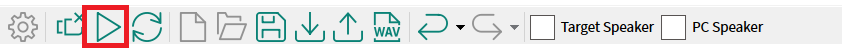

[Click here](../README.md) to view the README.

## Design and implementation

The design of this application is minimalistic to get started with code examples on PSOC™ Edge MCU devices. All PSOC™ Edge E84 MCU applications have a dual-CPU three-project structure to develop code for the CM33 and CM55 cores. The CM33 core has two separate projects for the secure processing environment (SPE) and non-secure processing environment (NSPE). A project folder consists of various subfolders, each denoting a specific aspect of the project. The three project folders are as follows:

**Table 1. Application projects**

Project | Description
--------|------------------------
*proj_cm33_s* | Project for CM33 secure processing environment (SPE)
*proj_cm33_ns* | Project for CM33 non-secure processing environment (NSPE)
*proj_cm55* | CM55 project

In this code example, at device reset, the secured boot process starts from the ROM boot with the secured enclave (SE) as the root of trust (RoT). From the secure enclave, the boot flow is passed on to the system CPU subsystem where the secure CM33 application starts. After all necessary secure configurations, the flow is passed on to the non-secure CM33 application. Resource initialization for this example is performed by this CM33 non-secure project. It configures the system clocks, pins, clock to peripheral connections, and other platform resources. It then enables the CM55 core using the `Cy_SysEnableCM55()` function.

This code example runs entirely on the Arm® Cortex® M55 core. PDM mics capture the audio data and this data is fed to the AFE middleware, which processes the audio data with the AFE components enabled via the AFE Configurator tool.

In **functional** mode, The PSOC™ Edge MCU enumerates as a **USB Audio Stereo Speaker** device and a **USB Audio Mono channel** microphone device on the PC when connected via the USB cable while in **tuning** mode, the MCU enumerates as a **USB Audio Stereo** speaker device and a **USB Audio Quad channel** microphone device.

Any audio stream can be played from the PC and streamed over the **USB Audio Stereo Speaker** device to the PSOC™ Edge MCU. This audio stream received over USB is played back on the PSOC™ Edge MCU onboard speaker and also used as the AEC reference. The AFE components use the PDM audio data and USB reference data and processes the PDM audio data. The AFE middleware outputs the processed audio data. This is sent via USB back to the PC. On the PC, this data is received over the **USB Audio Mono channel** microphone device in **functional** mode.

The user button (USER_BTN1) controls whether the AE-processed or unprocessed data is received back on the PC. If the LED is blue, it means the AE-processed data is received over USB.

You can visualize the data using Audacity and play back the received audio data also using PC speakers.


## Code structure

**Figure 1. Structure of this code example**


## Code flow

**Figure 2. Code flow sequence**


## Customization

The AFE Configurator tool lets you choose and customize the AFE components that run on PSOC™ Edge.

The AFE Configurator tool requires the AFE Configurator project file provided in the code example. It is available in: 
*proj_cm55\source\audio_enhancement_application\audio_enhancement\ae_configuration.mtbafe*.

To open this project file: 

  - Open *ae_configuration.mtbafe* using the AFE Configurator tool via Eclipse IDE
  
    or,

  - Click **Audio FE Configurator** under **proj_cm55** in Eclipse IDE
  
    or,
    
  - In case if not using Eclipse IDE, open the proj_cm55 folder in the modus-shell and run "make audio-fe-configurator"
   
    or,
    
  - Open the *ae_configuration.mtbafe* via audio-fe-configurator.exe located in `C:\Users\[username]\Infineon\Tools\DEEPCRAFT-Audio-Enhancement-Tech-Pack\tools\audio-fe-configurator`

The PDM mic mode is controlled by the AFE Configurator. To choose between mono or stereo input, choose the options as:

**Figure 3. Choosing input in AFE Configurator**


    
If you select the **USB Audio Out**, the PDM mic will not be enabled. You can stream audio via USB for benchmarking and evaluation of AFE middleware but the streamed audio will not be played on the device speaker. In **USB Audio Out** mode – it is always stereo input.

The AFE Configurator generates *cy_afe_configurator_settings.c* and *cy_afe_configurator_settings.h* files when saving the project. These files contain the AFE filter settings and other options such as the components enabled.

The AFE relies on statically compiled files for this operation. The GeneratedSource contains the _*.c_ and _*.h_ files and these codes are automatically built during the build process.

The generated files are available at *proj_cm55\source\audio_enhancement_application\audio_enhancement\GeneratedSource*

A limited set of parameters can be set dynamically from AFE Configurator. To send the parameters to the PSOC™ Edge MCU: 

1. Close Tera Term or any other UART Terminal windows on the PC

2. Connect the AFE Configurator to the PSOC&trade; Edge MCU. <br> The AFE Configurator command/response is communicated via UART. Since the same KitProg3 USB-UART is used for debugging, once AFE Configurator is connected, all logs from the PC are diverted to AFE Configurator log file that is saved on PC

3. To connect the AFE Configurator to the kit, select the icon as shown here:

    **Figure 4. Connecting AFE Configurator to the kit**

    

4. Ensure that the bridge status is shown as connected

    **Figure 5. Bridge status display**

    

    You can set the following parameters dynamically using AFE Configurator:

    **Figure 6. Dynamically configurable parameters**

    
  
    For example, to disable **Noise Suppression**, unselect **Noise Suppression** and then **Sync filter settings** > **Load to device**

    **Figure 7. Disabling a parameter**
    
    

5. Check the processed audio recorded via Audacity while the LED is Blue. Noise suppression should be disabled and the processed audio should have background noise


## AFE tuning mode

The example also supports debugging or tuning the AFE via USB. In tuning mode, PSOC&trade; Edge MCU is enumerated as a 4-channel/Quad microphone to the PC. This mode is for debugging or tuning and to understand the AFE output for each of its components.

1. Choose the 4 individual channels to debug using the AFE Configurator:

    **Figure 8. Choosing channels to debug**
    
    

2. After choosing the required data to be streamed back from PSOC&trade; Edge MCU to PC, save the AFE project

3. To switch to tuning mode, set `CONFIG_AE_MODE` in *common.mk* as: `CONFIG_AE_MODE=TUNING`

4. Build and flash the code

5. Incase if playback of audio is required on the kit speaker ( for eg) Acoustic Echo Cancellation tuning), Play any audio to the kit (from Internet streaming sites, media player on the PC by choosing Speakers(Audio Control))

6. To view the 4 channels, you can either use Audacity or the AFE Configurator:

    - In **Audacity**, set the driver to WASAPI and set the channels to 4 by chosing (Audio Control)Microphone, Ensure to set the sampling rate to 16kHz and other settings as shown in below picture

      **Figure 9. Audacity: audio settings**
    
      

      This enables viewing the quad channel output to debug AFE

      **Figure 10. Audacity: Viewing quad channel output**

      

    - To view using **AFE Configurator**, ensure to connect AFE Configurator to the device <br>

      1. Select the play icon and record for some time
      
          **Figure 11. AFE Configurator: Play icon**
          

      2. Press the stop button
      
          **Figure 12. AFE Configurator: Stop icon**
          
 
          AFE Configurator displays the 4 channels:
          
          **Figure 13. Viewing the quad channel output on AFE Configurator**
          
 
      3. Press Stop and save the quad channel audio using the save recording icon
      
          **Figure 14. AFE Configurator: Save recording**
          

      4. Use Audacity to import the file for further analysis

7. Any audio played to Speakers(Audio Control) via PC (media player, Internet streaming etc) will be played on the kit's speaker when Input Source is set to "Microphones" in AFE Configurator

8. AFE Configurator also provides an option to play audio on the kit speaker 

9. Incase if AFE Configuator is to be used for audio playback, ensure to load the required file to be played back with File->Load WAV Files... option and select "Target Speaker" checkbox. This operation requies reflashing the kit, so save the configuration, build and flash to the kit <br>

    **Figure 15. AFE Configurator: Load WAV file**

    

    **Figure 16. AFE Configurator: Select Target Speaker**
    

10. Select play button to playback the audio on the kit while simultaneously recording from the kit on the AFE Configuarator

11. Stop recording and use Audacity to import the file for further analysis

## Real-time view of audio stream and spectrogram via DEEPCRAFT&trade; Studio

To view the AFE-processed data, you can use either Audacity or AFE Configurator, as explained in previous sections.

However, with Audacity and AFE Configurator, only the data stream can be viewed in real time, but not the spectrogram view. Spectrogram can be viewed after finishing the recording.

For real-time preview of spectrogram, the code example includes a DEEPCRAFT&trade; Studio project. It is located at the 
*data_viewer* folder.

1. This project displays 2 channel audio, so apply the following configurations via AFE Configurator: 

    - Channel 0: Input[0]
    - Channel 1: Output

    **Figure 17. Configuring for the spectogram viewer**
    
     

    Save the configuration, and build and flash the settings to the kit

2. Open DEEPCRAFT&trade; Studio

    **Figure 18. DEEPCRAFT&trade; studio: Launch screen**
     

2. Open the *data_viewer* folder located in the code example's root directory

    **Figure 19. DEEPCRAFT&trade; studio: Opening a project**
     
 
3. Click on *Main.imunit* to view the project graph

    **Figure 20. DEEPCRAFT&trade; studio: View project graph**
     

4. Click the play icon to start project compilation

    **Figure 21. DEEPCRAFT&trade; studio: Start/Play icon**
     

    In the live session (live.imsession), you can view the required data according to your preferences. For example, in the following figure, only spectrograms are enabled for viewing and the raw data is masked as highlighted:

    **Figure 22. DEEPCRAFT&trade; studio: Customized visualization**
     

5. Click Record to view the real-time view of spectrograms

    **Figure 23. DEEPCRAFT&trade; studio: Real-time view of spectograms**
     


## KPI

The memory and MCPS of Audio Enhancement with all AFE components enabled on PSOC&trade; Edge MCU is shown in the **Figure 24**,

**Figure 24. Table showing the memory and MCPS for Audio Enhancement on PSOC&trade; Edge MCU**


To provide the highest performance while executing the code example, The AFE middleware's scratch and persistent memory are placed in the tightly coupled memory section (TCM).

```
uint8_t ae_scratch_memory[AE_ALGO_SCRATCH_MEMORY] __attribute__((section(".dtcm_data"), aligned(4)));
uint8_t ae_persistent_memory[AE_ALGO_PERSISTENT_MEMORY] __attribute__((section(".dtcm_data"), aligned(4)));

```
<br>

 For more information, see: *proj_cm55\source\audio_enhancement_application\audio_enhancement\audio_enhancement.c*.


The code uses custom linker scripts to place critical code and libraries in TCM and sections in SOCMem. The custom linker scripts are placed in the templates folder for Arm&reg; and LLVM compilers.

See the linker scripts for the file placement and data placement in the respective sections.

The custom linker scripts are placed in:

- *\templates\TARGET_KIT_PSE84_EVAL_EPC4\COMPONENT_CM55\TOOLCHAIN_ARM\pse84_ns_cm55.sct*

- *\templates\TARGET_KIT_PSE84_EVAL_EPC2\COMPONENT_CM55\TOOLCHAIN_ARM\pse84_ns_cm55.sct*

- *\templates\TARGET_KIT_PSE84_EVAL_EPC4\COMPONENT_CM55\TOOLCHAIN_LLVM_ARM\pse84_ns_cm55.ld*

- *\templates\TARGET_KIT_PSE84_EVAL_EPC2\COMPONENT_CM55\TOOLCHAIN_ARM\pse84_ns_cm55.ld*

Depending on the chosen compiler and BSP, one of the above is used. The custom linker scripts are auto-copied to the BSP folder while importing the project. If you make any modifications to them, you have to manually copy them to the bsp folder.

To profile the AFE middleware for the cycles: 

1. Enable the following in the *Makefile* of *proj_cm55*:

    ```
    #For Profilier
    COMPONENTS += PROFILER
    DEFINES += PROFILER_ENABLE
    ```
2. Enable the following flag in 
*proj_cm55\source\audio_enhancement_application\audio_enhancement\audio_enhancement_interface.h*:

    ```
    #define AE_APP_PROFILE                                (1)
    ```

The speech quality scores for every AFE component is shown as benchmark reference.

**Figure 25. Table showing speech quality scores**


> **Note:** To calculate the speech quality scores on the kit, you can generate your own test streams and see the Deep Noise Suppression Challenge repo on GitHub (https://github.com/microsoft/DNS-Challenge) for creating the Python scripts.

Following is a high-level overview of calculating speech quality scores. You can generate your own test streams, refer to Deep Noise Suppression Challenge for creating the python scripts.

1. Configure the Audio Enhancement code example in *functional* mode (set CONFIG_AE_MODE=FUNCTIONAL in common.mk) and choose the input as **USB Audio Out** in AFE Configurator

2. Enable the AFE component to benchmark in AFE Configurator and disable all other components. For example, to benchmark **Noise suppression**, select only this component in AFE Configurator

3. Save the configuration and flash to the device <br> There should be a set of test streams for benchmarking each AFE component. The test streams may be mixed with room impulse response (RIR) and noise depending on the AFE component to be benchmarked. Each test stream should also have an equivalent clean stream to serve as a reference

6. Run a python script or code on the PC to stream these test streams one by one to the device and record the AE-processed data that match to each input stream on the PC

7. Run a python script to take the AE-processed data and clean data as input and calculate the score

8. For AEC benchmarking, the test streams should have speech in one channel and AEC reference in the second. Set 
`#define AEC_QUALITY_MODE (1)` in *audio_data_feed.c* for AEC benchmarking


## How to evaluate the code example

To easily reproduce the results as shown in *Readme*, the code example contains a test stream. Set the code to `FUNCTIONAL` mode in common.mk.

The test stream is available in 
*\ae_test_stream\ae_test_stream.wav*.

1. Play it on any media player application. Use Audacity to record

2. Press user button (USER_BTN1) to see the waveforms change

You can also listen to the audio that is recorded to hear the differences in the processed and unprocessed streams.

The code can also be executed without playing out anything on the device speaker. For example, to check Noise Suppression, Beamforming with ambient noise, just record the USB audio and switch between AE processed and unprocessed audio via USER_BTN1 and observe the difference in captured audio

<br>